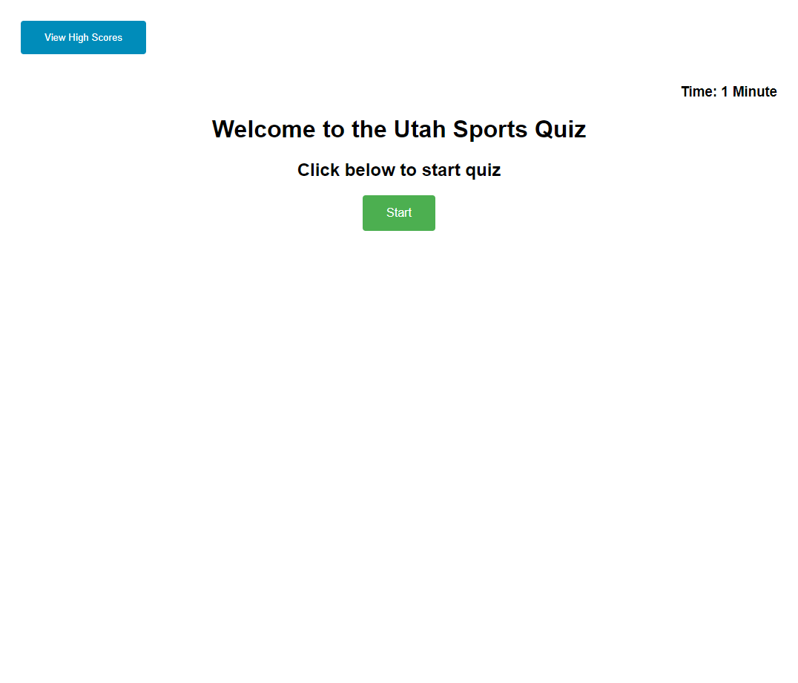
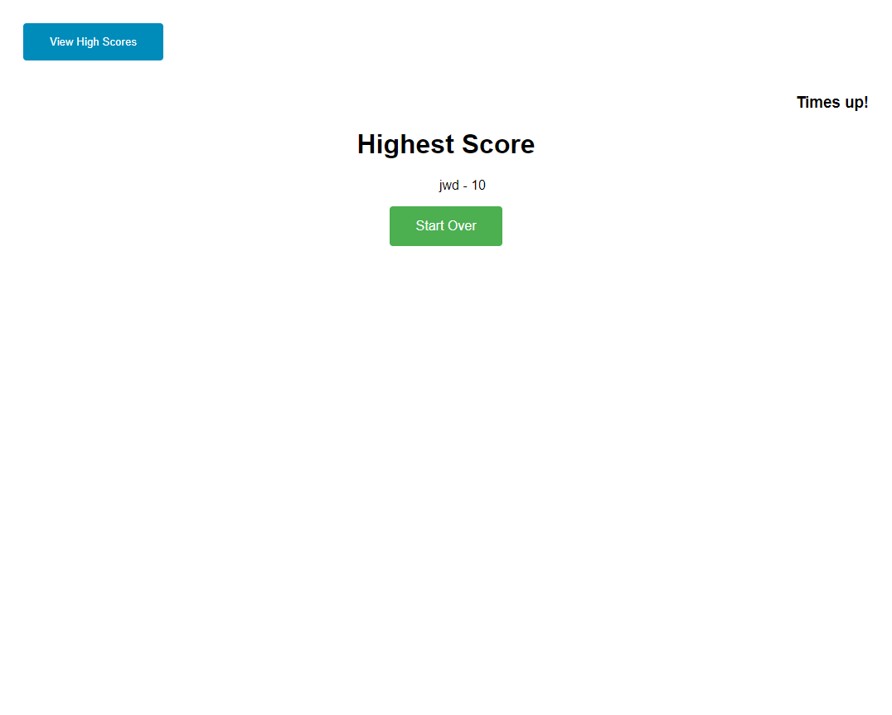

# Utah Sports Quiz 

## Description

Inspired by the great play of both the U of U football team and the Utah Jazz recently I decided to create a quiz about these two teams. I learned how to dynamically create visible html type code in javascript and send it to the DOM to display on the page. I learned how to use variables in both global and local scopes and how to transfer those variables from one function to another. I learned that you should probably stay away from doing a for loop within a for loop and to either use a forEach function or to just jump from one function to another when you are relying on input from the user. I also learned how to use and talk with arrays much more. Although simple, I learned how to create and assign css type styles to these elements within javascript. This project stretched me and I have probably learned the most from this project versus any other that we have done.

## Installation

Follow the following link to load code into a browser.

[Utah Sports Quiz](https://johndavis92790.github.io/sports-quiz/)

## Usage

Here is a screenshot of the finished webpage:

